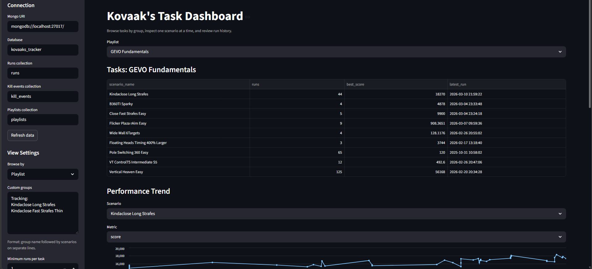
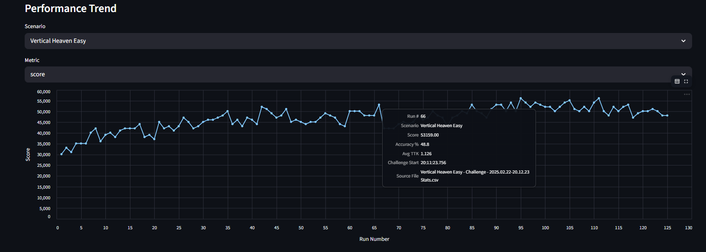
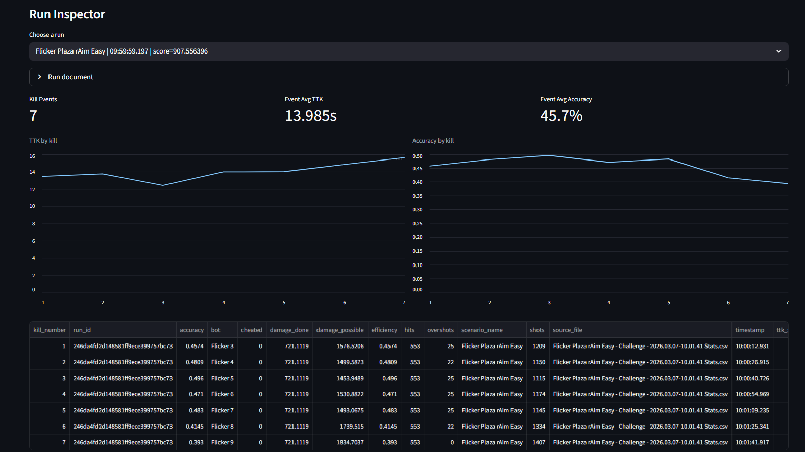

# Kovaak's Stat Tracker
### Overview
A locally run stat tracker that pulls your full Kovaak's scenario history and displays stats and trends in a dashboard. Saved Playlists are also pulled in order to group tasks into those playlist. Key features include number of runs, best score, latest run, performance trends for score/accuracy/etc. over time, an individual run inspector, and full run history. View settings allow for playlists, individual scenarios, or custom groups with an option for minimum runs per task. 

### Features

- **Full Scenario History Tracking**  
  Automatically ingests all locally saved Kovaak's run summaries into a database.

- **Playlist-Based Task Grouping**  
  Saved Kovaak's playlists are parsed and used to group scenarios in the dashboard.

- **Performance Trend Visualization**  
  Interactive charts show score, accuracy, kills, and other metrics across sequential runs..

- **Scenario-Level Analysis**  
  View total runs, best score, and most recent run for each task.

- **Run Inspector**  
  Inspect individual runs and their parsed statistics directly from the dashboard.

- **Kill Event Breakdown**  
  Detailed per-kill data including time-to-kill, accuracy, and shot counts.

- **Custom Scenario Groups**  
  Create custom training groups by listing scenarios directly in the dashboard.

- **Minimum Run Filtering**  
  Filter tasks to only show scenarios with a minimum number of completed runs.

### Architecture
The project uses a simple local data pipeline to ingest Kovaak's run data and visualize it in a dashboard.
```
Kovaak's Save Files
│
▼
stat_ingestion.py
(parses run summaries
and playlists)
│
▼
SQLite Database
kovaaks_tracker.db
├── runs
├── kill_events
├── playlists
└── playlist_scenarios
│
▼
Streamlit Dashboard
dashboard.py
```
The ingestion script parses Kovaak's run summary files and playlist definitions and stores the parsed results in a local SQLite database (kovaaks_tracker.db).  The Streamlit dashboard queries this database to provide interactive visualizations, scenario summaries, and run inspection tools.

### System Requirements
**Python 3.10+**

**Python packages**
- Streamlit
- Pandas
- Altair

Install dependencies with:

`pip install -r requirements.txt`

**Kovaak's save files** for accessing scenario data, typically found at:

`C:\Program Files (x86)\Steam\steamapps\common\FPSAimTrainer\FPSAimTrainer`

No external database is required — the project uses a local SQLite database automatically created during ingestion.

### To run
1. Copy the repo using standard methods like `git clone https://github.com/Hawklight1/kovaaks_tracker`
2. Set up a virtual environment, preferably via pip with `python -m venv .venv `
3. Install requirements with `pip install -r requirements.txt`
4. Ingest Kovaak's stats into the local SQLite database with `python stat_ingestion.py` (This creates a local database file: `kovaaks_tracker.db`)
5. Load dashboard with `streamlit run dashboard.py`

### Dashboard Preview

Overview page for playlist, scenario, or custom group.



Performance trends for each task.



Inspect individual run statistics.

